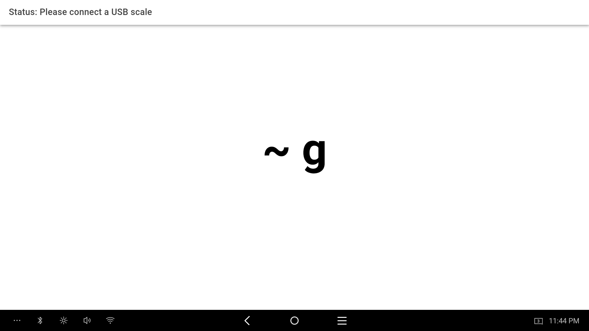
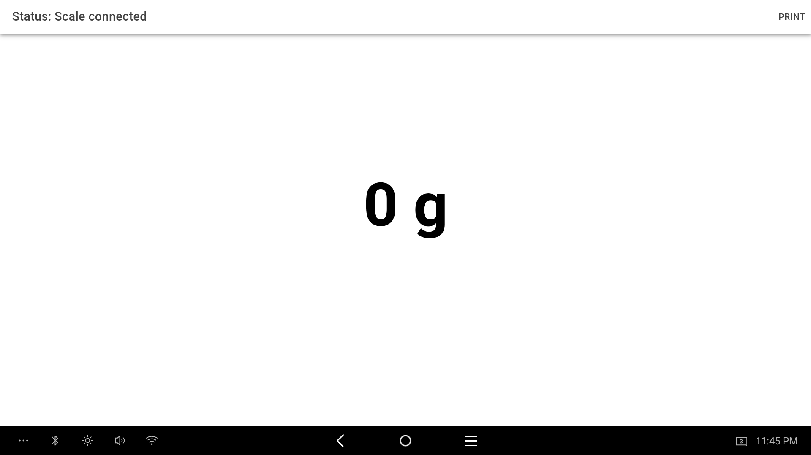
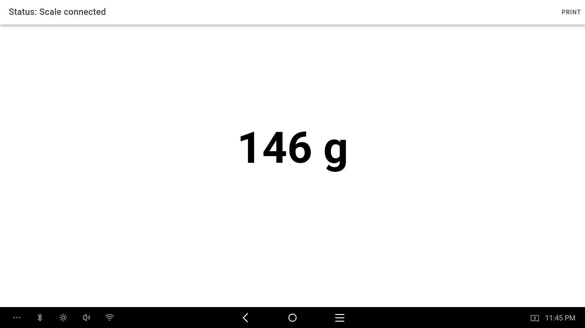
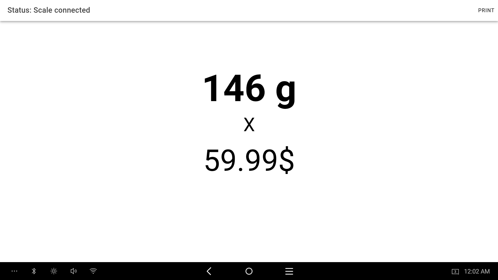
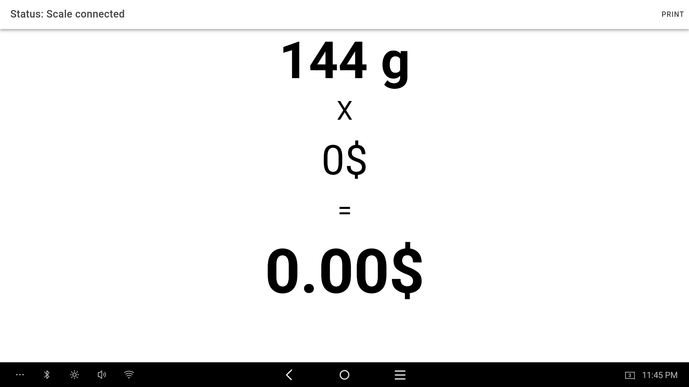
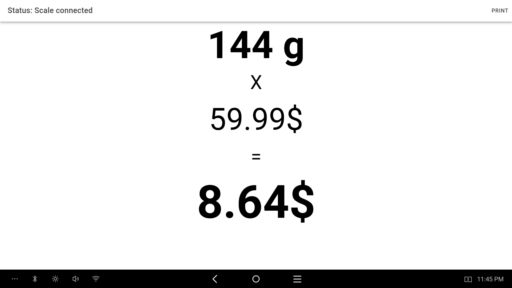

# Demo App: USB Scale Printer

This app demonstrates how to use the @kduma-autoid/capacitor-usb-scale plugin to connect to a USB scale 
and print a receipt on Sunmi T2 Mini built-in printer using @kduma-autoid/capacitor-sunmi-printer plugin.
Additionally, it shows how to use the @kduma-autoid/capacitor-sunmi-keyboard-handler to interact with the user,
using external keyboard to input price and print receipt using hotkey.
To use this app, you need to have a Sunmi T2 Mini device with a built-in printer and a USB scale.

## Screenshots

